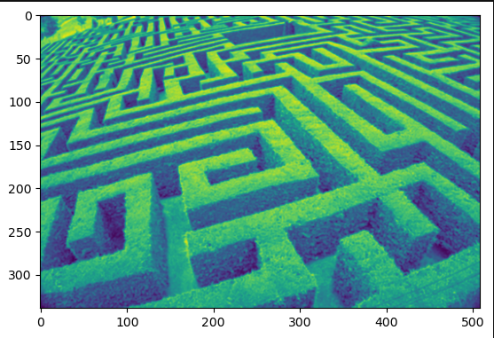
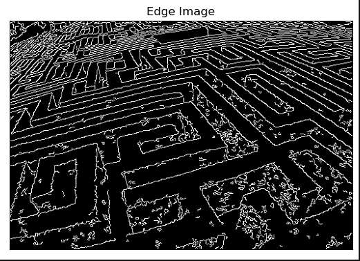
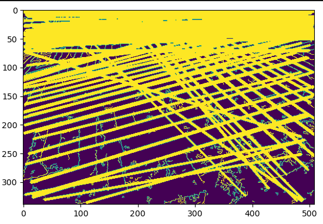

# Edge-Linking-using-Hough-Transform
## Aim:
To write a Python program to detect the lines using Hough Transform.

## Software Required:
Anaconda - Python 3.7

## Algorithm:
### Step1:
Import the necessary packages.

### Step2:
Read the image.

### Step3:
Convert the image into greyscale.

### Step4:
Using canny operator,detect the edges of the image.

### Step5:
Detect line co-ordinates for every points in the images.


### Step6:
Draw the lines on the found co-ordinates and display the image.


### Step7:
End the program.


## Program:
```Python
#Developed by: Shakthi kumar S
#Register number: 212222110043

# Read image and convert it to grayscale image
import cv2
import numpy as np
import matplotlib.pyplot as plt
image1=cv2.imread('maze.jpg',0)
img= cv2.GaussianBlur(image1,(3,3),0)
plt.imshow(img)

# Find the edges in the image using canny detector and display
edge = cv2.Canny(img,100,200)
plt.imshow(edge,cmap = 'gray')
plt.title('Edge Image'), plt.xticks([]), plt.yticks([])
plt.show()

# Detect points that form a line using HoughLinesP
lines=cv2.HoughLinesP(edge,1,np.pi/180, threshold=80, minLineLength=50,maxLineGap=250)

# Draw lines on the image
for line in lines:
    x1, y1, x2, y2 = line [0] 
    cv2.line(edge,(x1, y1),(x2, y2),(255, 0, 0),3)
plt.imshow(edge)

# Display the result
plt.imshow(edge)

```
## Output

### Input image and grayscale image


### Canny Edge detector output


### Display the result of Hough transform


## Result:
Thus the program is written with python and OpenCV to detect lines using Hough transform. 
